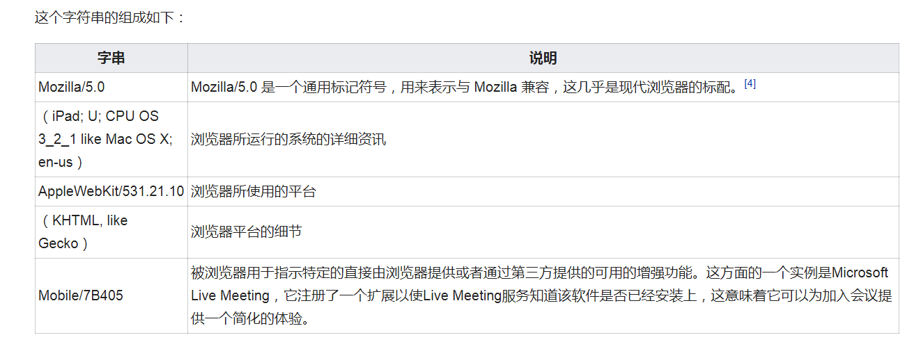

###用户代理
>客户端在访问服务器时，用一个特殊的字符串来标识自己，包含了应用程序的类型，操作系统，软件供应商等，在http协议中，这个字段是通过user-agent的头字段发送的；通过使用rebot.txt文件的设定，可以规范网络爬虫的访问权限，让网站不被特定的浏览器访问；
绝大多数网页的用户代理格式：Mozilla/[version] ([system and browser information]) [platform] ([platform details]) [extensions]

