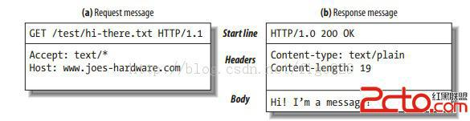
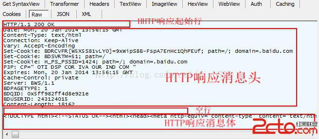

## 请求与响应

### 请求
* 浏览器发送数据包到服务器上，发送的包称为请求包，这个过程称为请求,request；
#### 请求数据包包含了以下部分：
* 起始行--> 包括了请求方法，请求的资源，http协议的版本号
* 消息头--> 包含了众多属性，例如编码方式，设置cookie，文本编码方式，cookie的最大有效时间等
* 空行--> 表示消息头部的结束
* 消息体(可选的)--->包含要传输的数据

####请求的方法
* get-->向指定的资源发出“显示”请求。传输是使用明文传输
* post-->向指定资源提交数据，请求服务器进行处理（例如提交表单或者上传文件）。数据被包含在请求本文中。这个请求可能会创建新的资源或修改现有资源，或二者皆有
* head-->与GET方法一样，都是向服务器发出指定资源的请求。只不过服务器将不传回资源的本文部分。它的好处在于，使用这个方法可以在不必传输全部内容的情况下，就可以获取其中“关于该资源的信息”（元信息或称元数据）
* other(很少用到)
**HTTP服务器至少应该实现GET和HEAD方法**

#### 常用浏览器代理user-agent
[浏览器代理](https://zhuanlan.zhihu.com/p/21252983)

### 响应
* 服务器接受到请求包，返回数据包的过程称为响应，返回的数据包称为响应数据包，response
**响应数据包和请求包所包含的基本类似**
* 起始行--->包含了响应码，http协议版本号，响应状态
** 其他都类似于请求包**

## Cookie
* 网站为了辨别用户身份，会发送一些小文本的数据到客户端，这些数据存放在客户端的内存或者硬盘中，通常是加密的；
> 内存cookie：存在于客户端内存中，由浏览器维护，当浏览器关闭时，内存cookie被删除，存在时间较短，也称为非持久性cookie
> 硬盘cookie:存在于硬盘中，有一个过期时间，max-age，定义在响应包的头部信息中，除非用户手工清理或者超过过期时间，否则它会一直存在于硬盘里，也称为持久性cookie
* 用途：由于http协议是无状态的，所以服务器和客户端的会话难以维持，服务器不知道客户端上一步做了什么；为了避免这个问题，服务器会和客户端建立连接时就发送一段cookie，下一次客户端进行请求时，就会包含这段cookie，服务器通过验证这段cookie，来确定用户身份，以及用户之前的操作
* wiki给出了cookie的典型应用场景
> 在刚才的购物场景中，当用户选购了第一项商品，服务器在向用户发送网页的同时，还发送了一段Cookie，记录着那项商品的信息。当用户访问另一个页面，浏览器会把Cookie发送给服务器，于是服务器知道他之前选购了什么。用户继续选购饮料，服务器就在原来那段Cookie里追加新的商品信息。结帐时，服务器读取发送来的Cookie就行了。
* 另一个应用场景
> Cookie另一个典型的应用是当登录一个网站时，网站往往会请求用户输入用户名和密码，并且用户可以勾选“下次自动登录”。如果勾选了，那么下次访问同一网站时，用户会发现没输入用户名和密码就已经登录了。这正是因为前一次登录时，服务器发送了包含登录凭据（用户名加密码的某种加密形式）的Cookie到用户的硬盘上。第二次登录时，如果该Cookie尚未到期，浏览器会发送该Cookie，服务器验证凭据，于是不必输入用户名和密码就让用户登录了。

** cookie的缺陷：cookie是明文传输，所以容易被截获，除非用https协议，这样所有的cookie都是被加密的**

#### cookie的构成
> Cookie是http消息头中的一种属性，包括：Cookie名字（Name）Cookie的值（Value），Cookie的过期时间（Expires / Max-Age），Cookie作用路径（Path），Cookie所在域名（Domain），使用Cookie进行安全连接（Secure）。 前两个参数是Cookie应用的必要条件，另外，还包括Cookie大小（Size，不同浏览器对Cookie个数及大小限制是有差异的）。

[参考资料1](http://blog.51cto.com/oanyt/1659878)
[参考资料2](https://zh.wikipedia.org/wiki/%E8%B6%85%E6%96%87%E6%9C%AC%E4%BC%A0%E8%BE%93%E5%8D%8F%E8%AE%AE)